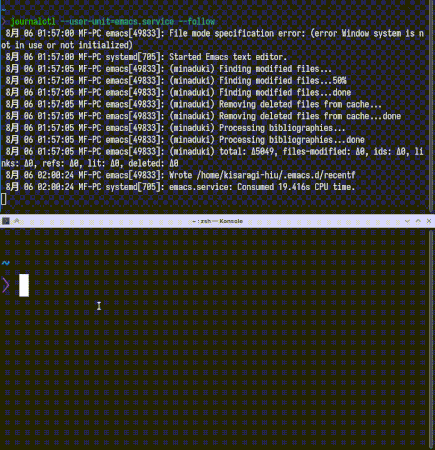
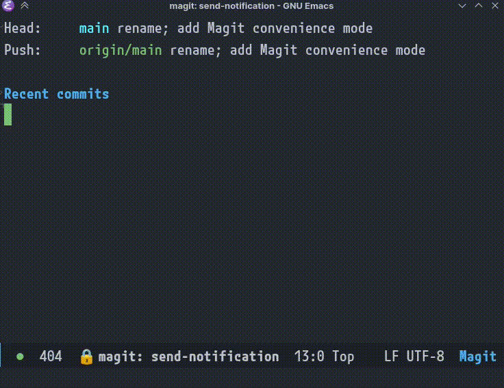

# send-notification

Send a desktop notification.

This serves as both a library for sending desktop notifications with zero config and a package of integrations.

## Install

```elisp
(straight-use-package
 '(startup-notification
   :host github
   :repo "kisaragi-hiu/send-notification"))
```

## Usage

### As a library

The entry point is `send-notification`.

```elisp
(send-notification "Some text")
```

Keyword arguments:

- `:body`: the body text of the notification.
- `:app-name`: defaults to Emacs
- `:icon`: only works for notify-send, an icon name to pass to it

### Startup notification

Send a notification on startup.

```elisp
(when (daemonp)
  (send-notification-on-startup-mode))
```



### Notify if Magit command fails in the background

When a Magit command encounters an error in the background, send a desktop notification.

```elisp
(with-eval-after-load 'magit
  (send-notification-on-magit-error-mode))
```


(Notification is only sent if no Magit buffers are displayed.)

## Acknowledgements

The (attempted) support for Windows is lifted from [alert-toast](https://github.com/gkowzan/alert-toast), © 2020, 2022 Grzegorz Kowzan.

## Prior art

- [alert](https://github.com/jwiegley/alert/) is the most full-featured, but it really is a `message` replacement that allows the user to also send it elsewhere. It thus doesn't seem to automatically detect the platform and use the right style for you. To get it to work on Windows you also need an extra package, [alert-toast](https://github.com/gkowzan/alert-toast).
- Builtin [notifications.el](https://git.savannah.gnu.org/cgit/emacs.git/tree/lisp/notifications.el) relies on D-Bus. This is the best option if you don't need to support macOS or Windows.
- [notify.el](https://github.com/emacsattic/notify) is unmaintained and also relies on D-Bus.
